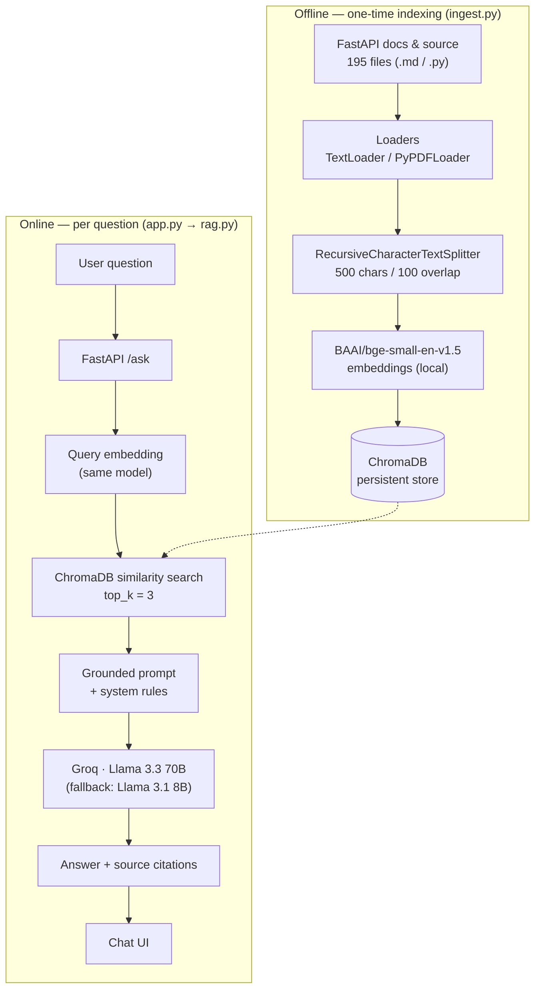

# FastAPI Documentation Assistant

**A Retrieval-Augmented Generation (RAG) assistant that answers questions using only the official FastAPI documentation — and says so honestly when it doesn't know.**

<p>
  
  
  
  
  
  
</p>

Ask it something like *"how do I use dependency injection with a database session?"* and it will search a locally indexed copy of the FastAPI docs and source code, pull the exact passages that answer the question, and hand them — and only them — to an LLM to write the response. Every answer comes back with the file, path, and chunk it was built from, so nothing it says is unverifiable. Ask it something outside the docs, and it tells you it can't find the answer instead of making one up.

> 📄 Looking for the *design reasoning* behind every technology choice — why Groq, why this embedding model, why this chunk size, the architecture diagram, and the evaluation results? See **[REPORT.docx](./REPORT.docx)**. This README is the "how to run it" guide.

---

## Contents

- [What this actually does](#what-this-actually-does)
- [How it works, in one picture](#how-it-works-in-one-picture)
- [Tech stack](#tech-stack)
- [Why these choices, briefly](#why-these-choices-briefly)
- [Project layout](#project-layout)
- [Getting started](#getting-started)
- [Indexing the documentation](#indexing-the-documentation)
- [Running the app](#running-the-app)
- [Using it](#using-it)
- [API reference](#api-reference)
- [Configuration](#configuration)
- [Troubleshooting](#troubleshooting)
- [Where this could go next](#where-this-could-go-next)

---

## What this actually does

General-purpose LLMs are fluent, confident, and sometimes flat-out wrong about framework specifics — a plausible-sounding answer about a decorator or a parameter isn't the same as a correct one. This project sidesteps that by never letting the model answer from memory. Instead:

- The **FastAPI documentation and source code** are chunked, embedded, and stored in a local vector database.
- Every question is answered **only** from the chunks retrieved for it.
- If the retrieved chunks don't contain the answer, the assistant says so — it does not guess.
- Every answer ships with **source citations** (file name, path, and chunk number) so you can verify it yourself.

It's wrapped in a small FastAPI backend and a clean, dependency-free chat interface with light/dark themes.

## How it works, in one picture



## Tech stack

| Layer | Choice |
|---|---|
| Backend / API | **FastAPI** + Jinja2 templates |
| Orchestration | **LangChain** (loaders, text splitter, vector store interface) |
| LLM | **Groq — Llama 3.3 70B**, with automatic fallback to Llama 3.1 8B |
| Embeddings | **BAAI/bge-small-en-v1.5** (local, via `sentence-transformers`) |
| Vector store | **ChromaDB** (persistent, file-backed, no server to run) |
| Document loaders | `TextLoader` (.md / .txt / .py) and `PyPDFLoader` (.pdf) |
| Frontend | Vanilla HTML / CSS / JS — zero build step, dark & light themes |

## Why these choices, briefly

- **Groq + Llama 3.3 70B** — once retrieval has done the hard work of finding the right passage, generation is closer to "summarise this accurately" than "reason from scratch," so a 70B open model is plenty. Groq's LPU inference is extremely fast, which makes the chat interface feel instant, and its developer tier is free.
- **BAAI/bge-small-en-v1.5** — embeddings run on nearly every request (every chunk at ingest, every question at query time), so keeping them local and free mattered. BGE-small punches well above its size on retrieval benchmarks and embeds fast enough to make re-indexing painless.
- **ChromaDB** — the corpus produces a few thousand chunks, which a local, file-persisted vector store searches in-process in a fraction of a second. It also stores metadata (file name, path, chunk number) alongside each vector automatically, which is exactly what's needed for citations — no hosted database or extra bookkeeping required.
- **500-character chunks, 100-character overlap** — close to one paragraph of the FastAPI docs, which are already organised one concept per paragraph. Overlap keeps sentences near a chunk boundary from being cut in half. This was tuned empirically against real questions, not assumed.

The full reasoning, including the alternatives that were considered and rejected, is in **[REPORT.docx](./REPORT.docx)**.

## Project layout

```
RAG_Project/
├── app.py              # FastAPI app: routes (/, /health, /ask)
├── rag.py              # Retrieval + prompt construction + generation
├── ingest.py            # Loads data/, chunks it, builds the ChromaDB index
├── config.py            # Every tunable setting lives here
├── utils.py              # Logging + small helpers
├── requirements.txt
├── data/                 # Source documentation (not code you need to touch)
│   ├── documentation/    # FastAPI's official docs (.md)
│   └── Source_code/       # FastAPI's own source (.py) — for implementation-level questions
├── templates/
│   └── index.html        # Chat UI
├── static/
│   ├── style.css
│   └── script.js
└── chroma_db/             # Generated by ingest.py — not committed to git
```

## Getting started

**Requirements:** Python 3.11+, a free [Groq API key](https://console.groq.com/keys).

```bash
# 1. Clone and enter the project
git clone <your-repo-url>
cd RAG_Project

# 2. Create a virtual environment
python -m venv venv
source venv/bin/activate      # Windows: venv\Scripts\activate

# 3. Install dependencies
pip install -r requirements.txt
pip install langchain-huggingface   # used by ingest.py

# 4. Set your API key
echo "GROQ_API_KEY=your_key_here" > .env
```

## Indexing the documentation

Run this once, and again any time you add or change files in `data/`:

```bash
python ingest.py
```

This deletes any existing `chroma_db/` folder and rebuilds it from scratch, so re-running it never creates duplicate entries. Expect it to finish in well under a minute for the included corpus.

## Running the app

```bash
python app.py
# or: uvicorn app:app --reload
```

Then open **http://localhost:8000** in your browser.

## Using it

Type a question about FastAPI — parameters, dependency injection, security, testing, deployment, anything covered by the indexed docs — and the assistant answers with citations attached. Ask it something unrelated to FastAPI, and it will tell you it couldn't find the answer in the indexed documentation, rather than guessing.

## API reference

| Method | Path | Description |
|---|---|---|
| `GET` | `/` | Serves the chat interface |
| `GET` | `/health` | Reports whether the vector store and LLM client are both ready |
| `POST` | `/ask` | Accepts `{ "question": "..." }`, returns `{ "answer": "...", "sources": [...] }` |

```bash
curl -X POST http://localhost:8000/ask \
  -H "Content-Type: application/json" \
  -d '{"question": "How do I declare a path parameter?"}'
```

## Configuration

Every setting lives in `config.py` — nothing is hardcoded elsewhere. The ones you're most likely to touch:

| Variable | Default | What it controls |
|---|---|---|
| `GROQ_MODEL` | `llama-3.3-70b-versatile` | Primary generation model |
| `GROQ_FALLBACK_MODEL` | `llama-3.1-8b-instant` | Used automatically if the primary model fails |
| `EMBEDDING_MODEL_NAME` | `BAAI/bge-small-en-v1.5` | Embedding model for both ingestion and queries |
| `CHUNK_SIZE` / `CHUNK_OVERLAP` | `500` / `100` | Chunking parameters used by `ingest.py` |
| `TOP_K` | `3` | Number of chunks retrieved per question |
| `DATA_FOLDER` | `data` | Where `ingest.py` looks for source documents |

## Troubleshooting

| Symptom | Likely cause | Fix |
|---|---|---|
| `/health` shows `vector_db_ready: false` | `ingest.py` hasn't been run yet | Run `python ingest.py` |
| `/health` shows `llm_ready: false` | Missing or invalid `GROQ_API_KEY` | Check your `.env` file |
| `503` on `/ask` | Pipeline not fully initialised | Confirm both of the above, then restart the app |
| Slow or failed ingestion | Very large `data/` folder | Ingestion batches automatically, but very large corpora will simply take longer |

## Where this could go next

- Add a re-ranking step for sharper retrieval on exact technical terms
- Support multi-turn conversations with real backend memory
- Build an automated evaluation harness instead of manual spot-checks
- Ingest documentation directly from a URL or GitHub repo
- Stream answers token by token

---

Built as a demonstration of a complete, defensible RAG pipeline — every component was chosen deliberately and can be explained on demand. See **[REPORT.docx](./REPORT.docx)** for the full write-up.
